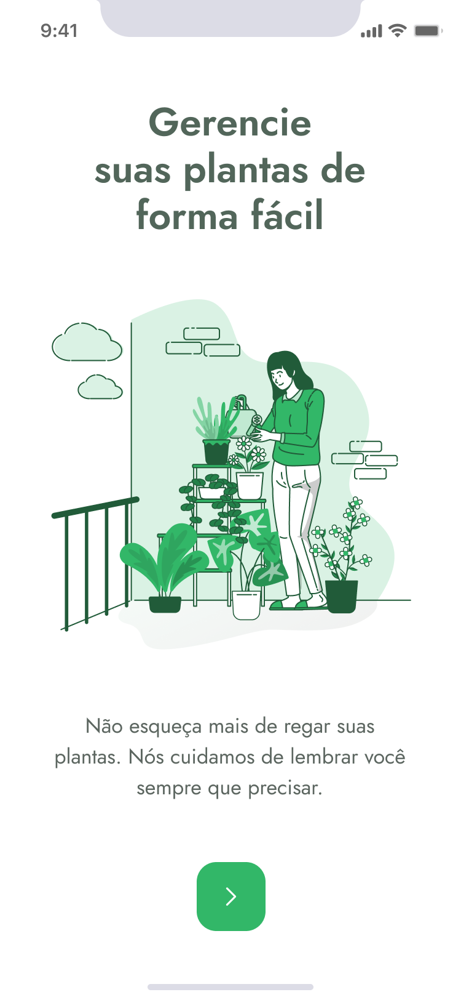
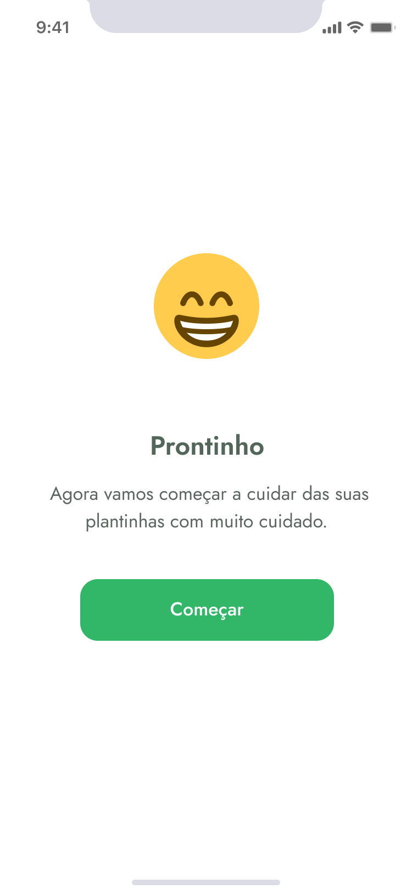
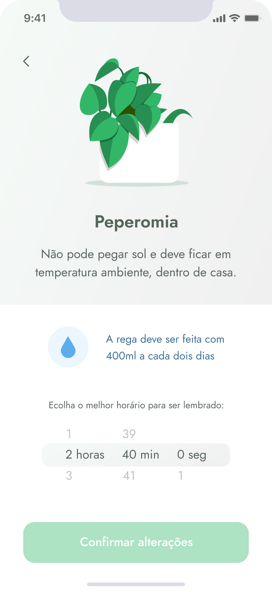
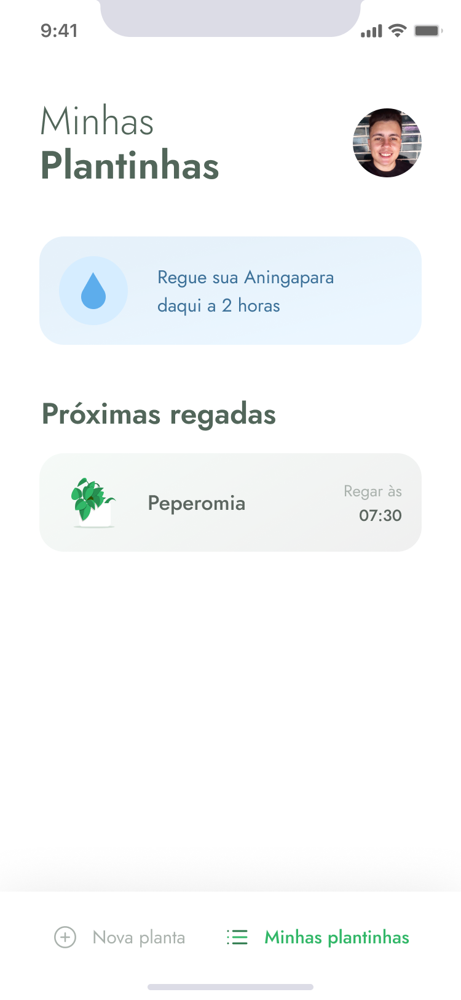

<p align="center">
   
</p>

# :page_with_curl: Table of Contents

* [About](#information_source-about)
* [Technologies](#computer-technologies)
* [Requirements](#page_with_curl-requirements)
* [Features](#rocket-features)
* [Images](#camera-images)
* [How to run](#seedling-how-to-run)
* [License](#pencil-license)

# :information_source: About

PlantManager is a mobile application that allows you to set reminders to water your plants, 
according to the type of plant and its frequency to be watered (daily or monthly).

The data used is consumed from a fake API, using the Json Server.

The project was developed during the Next Level Week 5 event, provided by Rocketseat.

# :computer: Technologies

- [React Native](https://reactnative.dev/)
- [Expo](https://expo.io/)
- [Typescript](https://www.typescriptlang.org/)
- [Json Server](https://github.com/typicode/json-server)

# :page_with_curl: Requirements

- [Node.js](https://nodejs.org/)
- [Yarn](https://yarnpkg.com/) (optional)
- [Expo](https://expo.io/)
- [Git](https://git-scm.com/) (to clone the repository)

# :rocket: Features

- Insert username
- List plants
- Infinite scroll in the plant list
- Filter plants by environment
- See plant details
- Save reminder to water a plant
- Sending notifications with reminders

# :camera: Images

<p>
  
  
  
  
  
  
</p>

# :seedling: How to run

### :iphone: App

```bash
# Clone the repository
$ git clone https://github.com/lucas-almeida-silva/plantmanager.git

# Go to the project folder
$ cd plantmanager

# Install Dependencies
$ yarn
# or npm install

# Run the application
$ expo start
# or npm run dev
```
Install the Expo app on mobile stores. Then, select the LAN option in the window 
that opened after running the application and scan the QR Code in the Expo app.

It is possible to use an emulator too.

*The phone and your the computer must be connected in the same wifi network.*
*It is necessary to change the IP in the package.json file (server section) and in the services/api.ts file (baseURL)*

### 📦 API

```bash
# Go to the project folder
$ cd plantmanager

# Run the fake API
$ yarn server
# or npm run server
```
# :pencil: License

This project is under the [MIT license](LICENSE).
